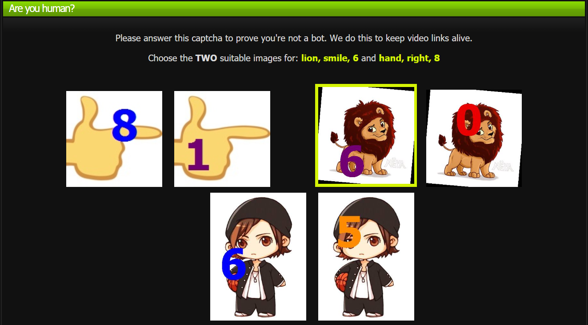

    

 

# kissSolver:
An A.I. C.A.P.T.C.H.A. Solver browser-extension for KissAnime written in JavaScript with help of python. It was/is being developed with the help of:

- tf.js and opencv.js

- OpenCV dev tools

- commandline use tensorflowjs 

- python implementation of os-library, numpy, opencv and keras

keras or tensorflowjs <i>might</i> not be required

 

## Installation:

Download the [kissSolver-prerelease.zip](https://github.com/ra101/kissSolver/files/3552801/kissSolver-prerelease.zip)

- #### Chrome

  1. Unzip file and save the folder on local drive.
  2. open [chrome://extensions/](chrome://extensions/)
  3. Turn on "Developer mode" on top-right.
  4. Click on "Load unpacked"
  5. navigate to and select kissSolver unzipped folder

- #### Others

  - Currently not working

    

## F.A.Q. regarding development:

### Problem Statement?

Self-Explanatory!

 

### How are images segregated?

There are 2 ways 

- Subtract pixel values from problem image given to generic image (image without number) [slow but accurate]
- Check for similar dimensions (images can have similar dimensions) [fast but inaccurate]

 

### What kind of A.I. is used?

1. **Haar Cascade**: *for finding out where is the number is in image* (ML)
2. **Convolutional Neural Network**: *for finding out what that number is* (DL)

  

## Documentation for development:

Check [docs/index.md](docs/index.md).

  

## A Special thanks to reddit user "Cloraxland" for below given post.
https://www.reddit.com/r/KissAnime/comments/8nuk9d/data_mined_captcha_data_all_captchas_grouped_into/
